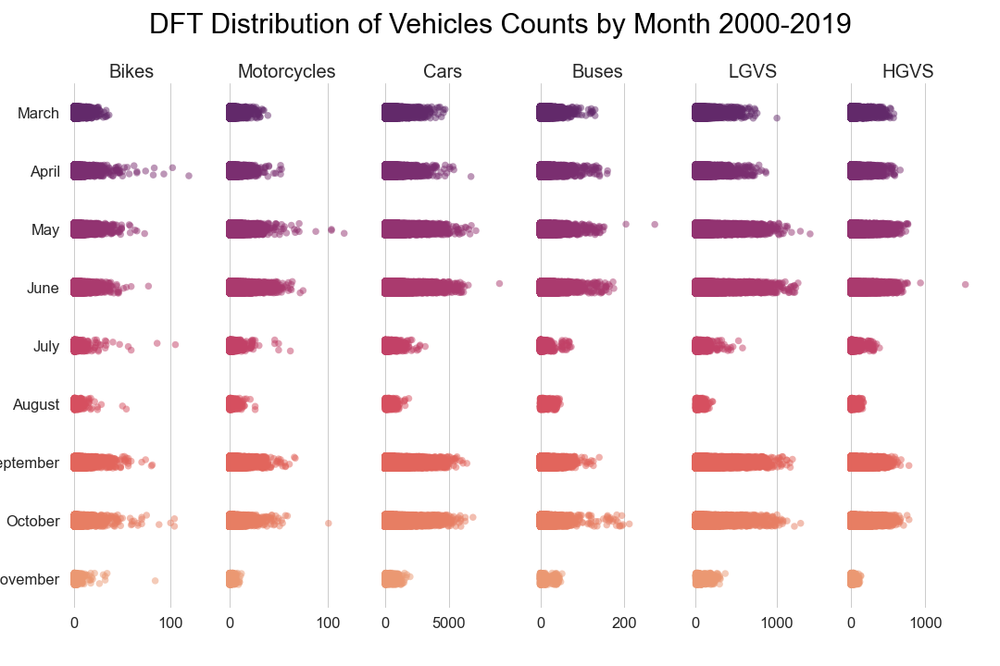

# 🚦 Introduction
A primary method of reporting road traffic by the Department for Transport (DfT) involves estimating Average Annual Daily Flow (AADF) of traffic on UK roads. Counts are manually performed at pre-determined locations (called 'count points'), periodically. Typically, these counts are collected over a 12-hour period, only on weekdays, between March to October. There may be inconsistencies in which roads are counted, year on year.

Utilising the public dataset under an Open Government License, we explore it to understand and present our insights on traffic trends in Scotland (because we are at the University of Edinburgh, naturally) covering a period from 2000 to 2019.

# 🚩 Data

The file `dft_rawcount_region_id_3.csv` contains the data for all manual counts performed on Scottish roads from 2000 to 2019.

In this data, a 'link' is the name used to refer to a particular **section** of road. A given road (i.e. a unique `road_name`) can contain multiple links. One "count point" is decided for each link (a location at which the count is made for that link), and given a unique `count_point_id`.

There are 33 columns in the data; the description of what each column represents is given here for reference. It's probably a good idea to have a look at the data first, and come back to these tables if you're not sure about one of the columns.
       
| Column name | Description |
|:--|:--|
| `count_point_id` | A unique reference number for each *link* (i.e. section of road) |
| `direction_of_travel` | Direction of travel: `N`, `S`, `E`, `W`, or `C` for 'Combined' (when the direction can't be easily determined) |
| `year` | Counts are shown for each year from 2000 onwards |
| `count_date` | The date when the actual count took place |
| `hour` | The time when the count took place, where 7 represents between 7am and 8am, and 17 represents between 5pm and 6pm |
| `region_id`, `region_name` | Website region identifier, and name of the region that the count point sits within (in the provided datafile, which is only for Scotland, these will always be `3` and `Scotland` respectively) |
| `local_authority_id`, `local_authority_name` | Website local authority identifier, and name of the local authority that the count point sits within (for instance, `Aberdeenshire`) |
| `road_name` | Road name (for instance `M9` or `A698` -- see e.g. the [green and purple labels in this map](https://www.scotlandinfo.eu/images/maps/scotroadmap1.jpg)). Note that `M..` roads are motorways, `A..` roads are major roads, `B..` roads are minor roads, and `C` and `U` roads are very small roads, which are not numbered (i.e. for example, all `C` roads have `road_name == 'C'`) |
| `road_type` | Whether the road is a `Major` or `Minor` road |
| `start_junction_road_name`, `end_junction_road_name` | The road names of the start and end junctions of the link |
| `easting`, `northing` | Easting and northing coordinates of the count point location |
| `latitude`, `longitude` | Latitude and longitude of the count point location |
| `link_length_km`, `link_length_miles` | Total length of the network road link for that CP (in kilometres and miles, resp.) |

The remaining columns all contain the observed number of vehicles for different types of vehicle:

| Column name | Vehicle description |
|:--|:--|
| `pedal_cycles` | Pedal cycles (e.g. bicycles) |
| `two_wheeled_motor_vehicles` | Two-wheeled motor vehicles (e.g. motorbikes) |
| `cars_and_taxis` | Cars and taxis |
| `buses_and_coaches` | Buses and coaches |
| `lgvs` | Light goods vans (e.g. commercial vans) |
| `hgvs_2_rigid_axle`, `hgvs_3_rigid_axle`,  `hgvs_3_or_4_articulated_axle`,`hgvs_4_or_more_rigid_axle`,  `hgvs_5_articulated_axle`, `hgvs_6_articulated_axle` |  Different kinds/sizes of heavy good vehicles (e.g. trucks, lorries) |
| `all_hgvs` | All heavy good vehicles combined |
| `all_motor_vehicles` | All motor vehicles combined (so all of the above, except cycles) |

# 📊 Results
Here we give a snippet of one of the visualizations we were able to generate using the DfT data.
